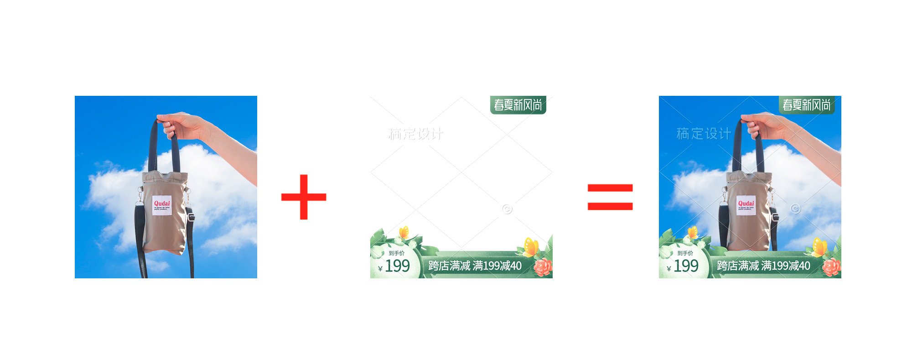

## 图标任务的并发控制
假设存在以下两个事务：设a为0
|时刻|T1|T2|a
|-|-------:|:------:|:------:
|1|begin||
|2|a += 1||1
|3||begin|
|4||a += 2|3
|5|a = 0||0
|6|commit||
|7||a = 0|0
|8||commit|

在事务并发的情况下，不加以控制，结果无法预测。 
一般情况下，通过加锁保证串行可以解决。

在业务需求中，图标任务相当于事务，在指定的时间段内给商品的图片加上水印。 
例如， 

为支持用户提前设置任务时间（无需熬夜值班手动操作），则要处理并发的情况：
|时间|任务A|任务B|商品图片
|-|-------:|:------:|:------:
|23:00|begin||
||a += 1||1
|00:00||begin|
|||a += 2|3
|01:00|a = 0||0
||结束||
|02:00||a = 0|0
|||结束|